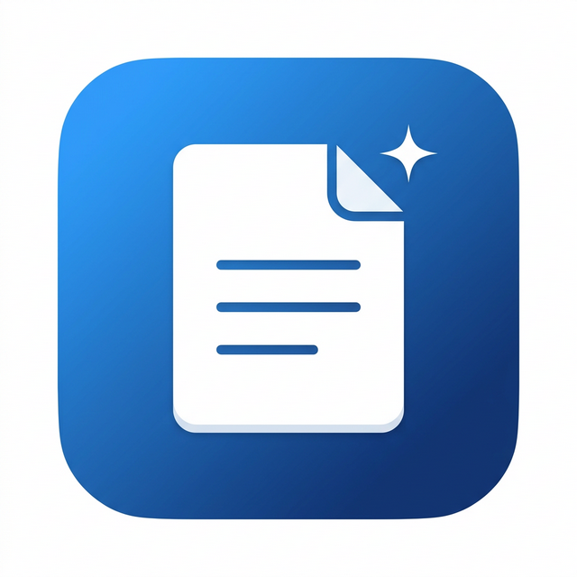

<p align="center">
  
</p>

<h1 align="center">Prompt Library</h1>

<p align="center">
  A clean, open-source desktop app to organize and manage your AI prompts.<br>
  Built with Electron. Available on Windows and macOS.
</p>

<p align="center">
  
  
  
</p>

---

## What It Does

Prompt Library gives you a single place to store, categorize, and copy your AI prompts. No cloud, no accounts — everything stays on your machine.

- **Folders** to organize prompts by topic
- **One-click copy** to clipboard
- **Image attachments** on prompts (upload, drag & drop, or `Ctrl+V` to paste)
- **Search** across all prompts instantly
- **Dark and Light mode** with smooth transitions
- **System tray** — the app stays running in the background
- **Desktop shortcut** created automatically on first launch

## Screenshots

> *Run `npm start` and see for yourself — the app looks best on your own machine.*

## Getting Started

### Prerequisites

- [Node.js](https://nodejs.org/) (v18 or newer)
- [Git](https://git-scm.com/)

### Installation

```bash
# Clone the repository
git clone https://github.com/YourUsername/prompt-library.git
cd prompt-library

# Install dependencies
npm install

# Start the app
npm start
```

That's it. The app opens immediately.

### Building Installers

To create distributable installers:

```bash
# Windows (.exe installer)
npm run build:win

# macOS (.dmg)
npm run build:mac

# Both
npm run build
```

Output files are saved to the `dist/` folder.

## Project Structure

```
prompt-library/
├── main.js                  # Electron main process
├── preload.js               # Secure bridge between main and renderer
├── package.json
├── build-resources/
│   ├── icon.png             # App icon (PNG)
│   ├── icon.ico             # App icon (Windows)
│   └── icon.svg             # App icon (source)
└── renderer/
    ├── index.html           # App layout
    ├── styles.css           # Soft UI design system
    └── app.js               # UI logic and state management
```

## How It Works

| Component         | Technology                              |
|-------------------|-----------------------------------------|
| Framework         | Electron 33                             |
| Storage           | [electron-store](https://github.com/sindresorhus/electron-store) (JSON on disk) |
| UI                | Vanilla HTML, CSS, JavaScript           |
| Design            | Soft UI / Neumorphic with blue accent   |
| Font              | [Inter](https://fonts.google.com/specimen/Inter) via Google Fonts |

All prompt data is stored locally in your system's app data folder. No external services, no telemetry.

## Features

### Prompt Management
- Create, edit, and delete prompts
- Assign tags for quick filtering
- Attach images (file upload, drag & drop, or paste from clipboard)
- Click any image thumbnail to view it full-size

### Organization
- Create, rename, and delete folders
- Prompts are grouped by folder
- Real-time search by name, text, or tags

### Design
- Soft UI aesthetic with neumorphic shadows
- Full dark and light mode support
- Smooth animations and micro-interactions
- Responsive layout for different window sizes

### System Integration
- Minimizes to system tray on close
- Click the tray icon to bring the app back
- Desktop shortcut created on first launch (Windows)
- Keyboard shortcuts: `Ctrl+N` (new prompt), `Ctrl+F` (search), `Ctrl+Enter` (save), `Esc` (close)

## Contributing

Contributions are welcome. Feel free to open an issue or submit a pull request.

1. Fork the repository
2. Create your feature branch (`git checkout -b feature/your-feature`)
3. Commit your changes (`git commit -m 'Add your feature'`)
4. Push to the branch (`git push origin feature/your-feature`)
5. Open a Pull Request

## License

This project is licensed under the [MIT License](LICENSE).
